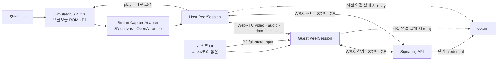
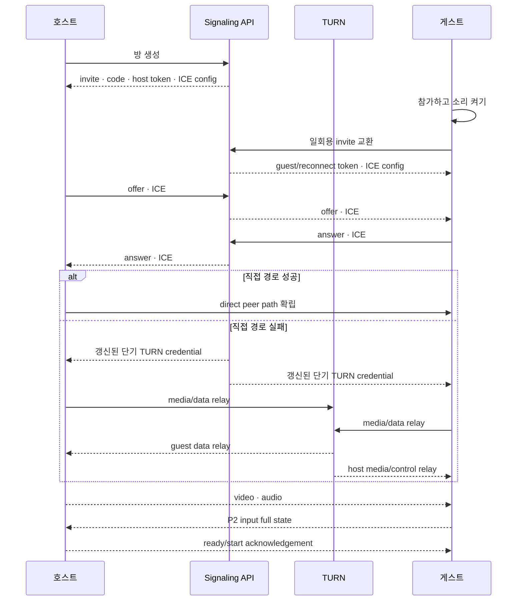

# 보글보글 2P WebRTC 화면 스트리밍 PoC 기획

- 작성일: 2026-07-16
- 기획 상태: `done`
- 구현 진입 상태: `needs-clarification`
- 대상 게임: 보글보글(Bubble Bobble, `bublbobl`)
- 대상 클라이언트: 모바일 Safari 우선, Android Chrome 비교 검증
- 문서 목적: 구현 범위, UX, 계약, 합격 기준을 확정한다. 이 문서 작성 세션에서는 코드를 구현하지 않는다.

## 1. 결론

PoC는 **호스트 한 대만 보글보글 ROM과 EmulatorJS를 실행하고, 게스트는 WebRTC로 화면·오디오를 받으면서 P2 입력만 전송하는 구조**로 만든다.

권장안은 현재 안정적으로 사용 중인 EmulatorJS 4.2.3을 유지하고, Ponpoko가 소유하는 얇은 WebRTC 계층을 추가하는 것이다. 4.3.0-pre의 netplay 구현은 캡처·재연결 설계 참고자료로만 사용하며 런타임 전체를 교체하지 않는다.

정상 사용 흐름의 목표는 앱 내부에서 다음 두 번의 의도적인 CTA 탭으로 끝나는 것이다. iOS 카메라 실행과 QR URL 배너 탭은 운영체제 동작이므로 이 수치에서 별도로 기록한다.

1. 호스트: 보글보글에서 `친구와 2인 플레이`를 한 번 탭한다.
2. 게스트: QR을 열고 `참가하고 소리 켜기`를 한 번 탭한다.

두 기기가 준비되면 코인과 2P 시작 입력을 자동 수행한다. 방 목록, 이름 입력, 비밀번호, 호스트의 별도 승인, ICE/TURN 선택은 요구하지 않는다. 자동 시작이 실패한 경우에만 `2P 시작 다시 시도`를 복구 동작으로 노출한다.

단, iOS에서 실제 EmulatorJS OpenAL AudioContext는 비동기 ROM 로드 뒤 만들어지므로 첫 host 탭의 사용자 활성화가 남아 있지 않을 수 있다. 실제 iPhone capture spike에서 1탭 audio resume이 실패하면 host에게 runtime 준비 뒤 `방 열고 소리 켜기` 한 번만 추가로 요청하는 호환성 fallback을 허용한다. 무음 상태로 연결 성공을 표시하지 않는다.

## 2. 성공 정의

PoC는 다음 조건을 모두 만족할 때 `Go`로 판정한다.

- 실제 iPhone 두 대의 Safari에서 guest CTA는 한 번이며, host는 기본 1탭 또는 WebKit 오디오 fallback을 포함한 최대 2탭으로 연결된다.
- 게스트는 ROM이나 EmulatorJS 코어를 요청하지 않는다.
- 게스트에서 영상과 소리가 재생되고 P2 좌·우·발사·점프가 동작한다.
- 호스트 P1과 원격 P2의 동시 입력이 서로 해제하거나 덮어쓰지 않는다.
- 직접 연결과 강제 TURN relay 연결을 각각 재현하고 통과한다.
- 연결 단절 시 2초 안에 P2 입력을 전부 해제하고, 60초 안의 복귀는 QR 재스캔 없이 복구한다.
- 20분 연속 플레이에서 복구 불가능한 멈춤과 stuck input이 없다.
- 기존 1P 자동 저장을 읽거나 덮어쓰지 않는다.
- 실패 시 사용자는 기술 용어가 아닌 한 가지 다음 행동을 안내받는다.

수치형 Go/No-Go 기준은 [14. 합격 기준](#14-합격-기준)에 정의한다.

## 3. 현재 기준선과 확인된 경계

### 3.1 저장소 기준선

- 보글보글은 `mame2003_plus`, `bublbobl.zip`, `bubbleBobble` 컨트롤 프로필을 사용한다: [`src/games/bubble-bobble.ts`](../../src/games/bubble-bobble.ts)
- 현재 네이티브 에뮬레이터 입력 계약은 player를 받지 않고, 런타임 호출이 P1인 `simulateInput(0, ...)`으로 고정되어 있다: [`src/native-emulator.ts`](../../src/native-emulator.ts), [`src/emulator.ts`](../../src/emulator.ts)
- 현재 입력 활성 상태는 player 구분 없이 input만 키로 관리한다. 원격 P2 도입 전에 `(player, input)` 단위로 분리해야 한다.
- 현재 vendored EmulatorJS 4.2.3 번들에는 `canvas.captureStream()`, `createMediaStreamDestination()`, `collectScreenRecordingMediaTracks()` 기반이 들어 있다: [`public/emulatorjs/emulator.min.js`](../../public/emulatorjs/emulator.min.js)
- GitHub Pages 배포는 정적 `dist`만 제공하므로 WSS 시그널링과 TURN을 호스팅할 수 없다: [`.github/workflows/deploy.yml`](../../.github/workflows/deploy.yml)
- 서비스 워커가 앱 셸과 런타임 리소스를 캐시하므로 배포 시 캐시 버전 갱신과 구버전 참가 URL 검증이 필요하다: [`public/service-worker.js`](../../public/service-worker.js)

### 3.2 조사에서 확인한 사항

- 로컬 Chromium과 모바일 WebKit 에뮬레이션에서 `RTCPeerConnection`, DataChannel, canvas capture, Web Audio destination의 API 존재를 확인했다.
- 로컬 Chromium과 모바일 WebKit에서 P2 직접 입력으로 `1UP`와 `2UP`가 함께 표시되는 것을 확인했다.
- 위 결과는 Mac 기반 확인이며 실제 iPhone의 캡처·오디오·백그라운드 동작을 증명하지 않는다. 실제 기기 통과를 별도 게이트로 둔다.
- EmulatorJS 4.3.0-pre의 upstream netplay는 호스트 캡처, 게스트 입력, 재협상 사례를 제공하지만 pre-release이며 코어 호환성 변화가 있어 전체 업그레이드는 PoC 범위를 넘는다.

## 4. 제품 범위

### 4.1 포함

- 보글보글 신규 2P 세션 한 종류
- 호스트 1명, 게스트 1명
- 호스트 화면과 게임 오디오 스트리밍
- 게스트 P2 좌·우·발사·점프 입력
- QR, 시스템 공유 링크, 8자리 수동 코드
- 직접 연결 실패 시 자동 TURN fallback
- 짧은 단절의 자동 재연결
- iOS 오디오 unlock과 foreground 복귀 처리
- 개발 진단과 PoC 지표 수집

### 4.2 제외

- 양쪽에서 ROM을 실행하는 lockstep 또는 rollback netcode
- 3인 이상, 관전자, 공개 방 검색
- 채팅, 음성 통화, 계정, 친구 목록
- Bluetooth 또는 Nearby 전용 연결
- 인터넷 없는 LAN-only pairing
- 게스트 ROM·코어 다운로드
- 기존 게임 전체로의 일반화
- 백그라운드·잠금 상태의 지속 플레이 보장
- host migration과 장기 세션 복구
- save state 전달 또는 2P 세션 저장
- production HA, 대규모 TURN 운영, 과금 최적화
- EmulatorJS 4.3.0-pre 전체 업그레이드

## 5. UX 원칙

1. **연결 기술을 숨긴다.** WebRTC, SDP, ICE, STUN, TURN이라는 단어를 사용자 화면에 표시하지 않는다.
2. **정상 경로의 결정을 줄인다.** 사용자에게 네트워크 경로나 품질 옵션을 선택시키지 않는다.
3. **권한을 요구하지 않는다.** 앱 내부 QR 스캐너를 만들지 않고 iOS 기본 카메라의 URL 스캔을 사용한다. 앱은 카메라와 마이크 권한을 요청하지 않는다.
4. **소리는 명시적 탭에서 연다.** 게스트의 `참가하고 소리 켜기` 탭 안에서 오디오와 재생 준비를 수행한다.
5. **실패마다 다음 행동은 하나만 준다.** 자동 복구 중에는 기다리게 하고, 복구가 끝난 뒤에만 `다시 연결`을 제시한다.
6. **게임 상태보다 입력 안전을 우선한다.** 연결이 의심되면 원격 입력을 즉시 neutral로 만든다.
7. **기존 1P 경험을 침범하지 않는다.** 2P 기능은 보글보글에만 노출하고 기존 실행·저장 경로를 그대로 둔다.

## 6. 사용자 흐름

### 6.1 호스트

1. 보글보글 실행 선택 화면에서 `친구와 2인 플레이`를 탭한다.
2. 동일한 사용자 동작 안에서 ROM 부팅, 캡처 준비, 방 생성을 시작한다. 실제 OpenAL context가 이미 있으면 resume한다.
3. 준비 화면에 QR, `링크 공유`, 8자리 코드, `취소`를 표시한다.
4. 게스트가 참가하면 `친구가 들어왔어요 · 게임을 준비하는 중`을 표시한다.
5. 영상·오디오·입력 채널이 모두 준비되면 자동으로 2P 신규 게임을 시작한다.
6. 플레이 중에는 작은 `P2 연결됨` 상태와 종료 동작만 남긴다.

호스트가 `친구와 2인 플레이`를 누른 행위가 한 명의 게스트를 받을 명시적 승인이다. 비밀 초대 토큰과 1명 제한이 있으므로 별도 승인 팝업을 추가하지 않는다.

runtime이 준비된 뒤에도 실제 OpenAL context가 `running`이 아니거나 non-silent audio track을 만들지 못하면 `방 열고 소리 켜기`를 표시한다. 이 fallback은 host 승인이나 네트워크 설정이 아니라 WebKit 오디오 unlock만 수행하며, 성공 후 다시 표시하지 않는다.

### 6.2 게스트

1. iOS 카메라로 QR을 스캔하거나 공유 링크를 연다. 스캔이 어려운 경우에만 게임 목록의 `2P 코드로 참가`에서 8자리 코드를 입력한다.
2. 앱은 `보글보글 2P에 참가`와 `참가하고 소리 켜기` CTA를 표시한다. 자동 연결하지 않는다.
3. 한 번의 CTA 탭으로 초대 교환, 게스트 AudioContext resume, WebRTC 연결, muted inline video 준비를 수행한다.
4. 연결 중에는 단계별 상태만 보여 준다.
5. 첫 프레임과 오디오가 준비되면 영상과 P2 전용 컨트롤을 표시한다.

게스트 화면에는 ROM 선택, 저장, 불러오기, 리셋, P1 컨트롤을 표시하지 않는다.

두 기기가 같은 공간에 있으면 스트림 지연 때문에 양쪽 스피커가 메아리처럼 들릴 수 있다. 연결 직후 `같은 공간이면 한 기기의 소리만 켜세요`를 짧게 안내하고 host와 guest 모두 즉시 접근 가능한 음소거 토글을 제공한다. 정상 참가를 막는 선택 단계로 만들지는 않는다.

### 6.3 핵심 화면 초안

```text
호스트 대기 화면                 게스트 참가 화면
┌──────────────────────┐       ┌──────────────────────┐
│ 보글보글 2P 방       │       │ 보글보글 2P에 참가   │
│                      │       │                      │
│      [ QR CODE ]     │       │ 호스트의 게임 화면과 │
│                      │       │ 소리를 받아요.       │
│ 코드  7KMF-2QWX     │       │                      │
│ [링크 공유]          │       │ [참가하고 소리 켜기] │
│                      │       │                      │
│ 같은 Wi-Fi가 빨라요  │       │ 카메라·마이크 권한은 │
│ [취소]               │       │ 사용하지 않아요.     │
└──────────────────────┘       └──────────────────────┘

게스트 플레이 화면
┌──────────────────────┐
│      게임 영상       │
│                      │
│ P2 연결됨            │
├──────────────────────┤
│  ◀   ▶      발사 점프│
└──────────────────────┘
```

### 6.4 사용자용 상태와 복구 문구

| 내부 상태 | 사용자 문구 | 자동 처리 | 사용자 동작 |
|---|---|---|---|
| 방 생성 중 | `2P 방을 만들고 있어요` | ROM·오디오·캡처·방 준비 | 없음 |
| 게스트 대기 | `친구 기기의 카메라로 QR을 스캔하세요` | 초대 대기 | 공유 또는 취소 |
| 초대 확인 | `방을 찾고 있어요` | 토큰 교환 | 없음 |
| 연결 중 | `친구 기기와 연결 중이에요` | 직접 연결 후 TURN fallback | 없음 |
| 미디어 준비 | `게임 화면을 준비하고 있어요` | 첫 영상·소리 확인 | 없음 |
| 연결 완료 | `P2 연결됨` | 자동 신규 게임 시작 | 플레이 |
| 순간 단절 | 기존 화면 유지 | 1.5초 input lease로 P2 neutral, UI는 2.5초 유예 | 없음 |
| 복구 중 | `연결을 복구하고 있어요` | ICE restart 또는 재생성 | 없음 |
| 호스트 숨김 | `호스트 화면이 잠시 멈췄어요` | foreground 복귀 대기 | 호스트가 화면 켜기 |
| 오디오 차단 | `소리가 꺼져 있어요` | 재생 가능 상태 확인 | `소리 켜기` |
| 복구 실패 | `연결하지 못했어요. 두 기기의 인터넷 연결을 확인해 주세요` | 진단 ID 생성 | `다시 연결` |
| 초대 만료 | `초대가 만료됐어요` | 세션 폐기 | 호스트가 새 QR 생성 |
| 호스트 종료 | `호스트가 2P를 종료했어요` | 입력·트랙·토큰 정리 | `게임 목록으로` |

순간 단절에서는 modal이나 spinner로 게임을 가리지 않는다. 2.5초가 지나면 호스트 게임을 일시정지하고 `연결 복구 중`을 표시한다. 호스트는 복구를 포기하고 `혼자 계속하기`를 선택할 수 있다.

## 7. 권장 아키텍처



### 7.1 소유 경계

| 컴포넌트 | 책임 | 금지 사항 |
|---|---|---|
| `PlayerInputAdapter` | `player`, input, press/release 계약과 활성 입력 분리 | 네트워크가 보낸 player 번호 신뢰 |
| `StreamCaptureAdapter` | 에뮬레이터 canvas와 OpenAL audio를 `MediaStream`으로 제공 | EmulatorJS 내부 객체를 UI에 노출 |
| `PeerSession` | RTCPeerConnection, media sender/receiver, DataChannel, stats | 방·토큰 정책 소유 |
| `SignalingClient` | 방 생성·참가, SDP/ICE 교환, 재접속, ICE 설정 수신 | UI 문구 결정 |
| `TwoPlayerSessionController` | 호스트/게스트 상태 머신, 자동 시작, 종료·복구 | 기존 1P 실행 경로 변경 |
| Signaling API | 초대 인증, 1:1 방, 메시지 relay, TURN credential | ROM·미디어·게임 입력 저장 |
| coturn | 직접 연결 실패 시 media/data relay | 장기 credential을 프런트엔드에 포함 |

### 7.2 런타임 선택

| 선택 | 판단 | 이유 |
|---|---|---|
| EmulatorJS 4.2.3 유지 + 선택적 adapter | 권장 | 현재 ROM 부팅·입력·저장·서비스 워커 회귀 범위를 제한한다. |
| EmulatorJS 4.3.0-pre 전체 교체 | 제외 | pre-release이며 코어·ES module·오디오·시작 감지까지 함께 변한다. |
| 게스트도 ROM 실행 | 제외 | 참가 시간, 배터리, 메모리, ROM 전송, 동기화 복잡도가 증가한다. |

upstream 코드는 개념 참고에 한정한다. 이후 코드를 직접 이식한다면 먼저 라이선스와 attribution 범위를 확인한다.

## 8. 요구사항과 추적성

| ID | 요구사항 | 수용 확인 |
|---|---|---|
| P1 | 호스트 한 대만 보글보글 ROM과 코어를 실행한다. | guest ROM·core·loader 요청, `EJS_emulator` 생성, ROM cache 접근 모두 0건 |
| P2 | 앱 내부 정상 경로는 host CTA 1탭·guest CTA 1탭을 목표로 하고, WebKit host audio fallback은 추가 1탭만 허용한다. | OS 카메라/URL 동작을 별도 기록하고, 앱 내부 guest 1탭·host 최대 2탭 외 필수 설정 없음 |
| P3 | QR, 시스템 공유 링크, 8자리 코드가 동일한 일회용 초대를 가리킨다. | 각 경로 성공, 5분 만료와 재사용 거부 확인 |
| P4 | 카메라·마이크 권한 없이 영상과 오디오를 재생한다. | Safari 권한 프롬프트 0회, 오디오 unlock 성공 |
| P5 | 30fps 게임 영상과 게임 오디오를 게스트에 제공한다. | 첫 frame/audio watchdog과 20분 stats 통과 |
| P6 | 원격 입력은 P2로만 고정하고 좌·우·발사·점프만 허용한다. | P1/P2 동시 입력 및 허용 목록 테스트 통과 |
| P7 | guest 준비 전 기존 startup assist를 막고, 양쪽 준비 후 신규 2P 시작을 한 번만 수행한다. | guest-ready 전 coin/start 0회, 연결·재연결·중복 메시지에서 시작 sequence 1회 |
| P8 | 직접 연결 실패 시 사용자 선택 없이 TURN으로 연결한다. | `relay` 강제 테스트 통과 |
| P9 | 짧은 단절은 자동 복구하고 60초 내 reload는 QR 재스캔 없이 복구한다. | 네트워크 전환·reload 매트릭스 통과 |
| P10 | 입력 heartbeat가 끊기면 2초 안에 P2 전체를 해제한다. | 강제 단절 20회에서 stuck input 0회 |
| P11 | 2P 세션은 기존 1P autosave를 읽거나 쓰지 않는다. | visibility/page lifecycle을 포함한 save 호출 0회, 전·후 checksum 동일 |
| P12 | 초대·시그널링·TURN credential을 최소 권한과 짧은 TTL로 관리한다. | 보안 계약 및 로그 redaction 테스트 통과 |
| P13 | 연결 시간, 경로, 품질, 복구를 개인정보 없이 관측한다. | 필수 stats 이벤트와 진단 ID 확인 |
| P14 | feature flag가 꺼지면 기존 1P·기존 게임·서비스 워커 동작이 그대로 유지된다. | 전체 기존 browser smoke와 catalog runtime smoke 통과 |

## 9. 세션·시그널링 계약

### 9.1 초대

- QR과 공유 링크 형식: `https://taekimax.github.io/ponpoko/#join=<opaque-token>`
- fragment는 HTTP 요청과 일반 referrer에 포함되지 않는다. 앱이 읽은 뒤 일회용 세션 토큰으로 교환하고 주소에서 제거한다.
- QR 초대 토큰은 128-bit 이상의 암호학적 난수, 일회용, TTL 5분이다.
- 수동 코드는 혼동 문자를 제외한 8자리이며 TTL 5분, IP·방 단위 rate limit을 적용한다.
- host 1명, guest 1명만 허용한다. 두 번째 guest는 기존 연결을 끊지 않고 거부한다.
- 연결된 PoC 세션 최대 시간은 60분, reconnect grace는 60초다.

### 9.2 최소 서버 계약

서버 구현 방식보다 아래 동작 계약을 먼저 고정한다.

- `POST /v1/rooms`: host session, 일회용 invite, 수동 코드, 만료 시각 생성
- `POST /v1/join`: invite 또는 코드 검증 후 guest session과 reconnect token 교환
- `GET /v1/ice-config`: 인증된 세션에 STUN과 짧은 TTL TURN credential 제공
- `WSS /v1/session`: 인증 후 SDP, ICE candidate, session control message만 relay
- `DELETE /v1/rooms/:id`: 호스트가 방 종료 또는 초대 취소
- `GET /healthz`: 배포·운영 확인용이며 방 정보와 credential을 반환하지 않음

정확한 URL과 provider SDK는 구현 착수 시 contract에 고정한다. 응답은 `Cache-Control: no-store`로 제공한다.

WSS 인증 토큰은 URL query에 넣지 않는다. socket open 직후 첫 application message로 보내고 서버는 인증 전 다른 메시지를 처리하지 않으며 3초 안에 인증되지 않으면 닫는다. 서버와 reverse proxy는 이 인증 frame을 로그에서 제거한다.

### 9.3 연결 순서



## 10. 미디어·입력 계약

### 10.1 영상과 오디오

PoC 기본값은 다음과 같다.

- 보글보글 화면을 512×448 2D staging canvas로 복사한 뒤 캡처
- 30fps, `contentHint="motion"`
- 초기 최대 영상 bitrate 약 1.5Mbps
- 가능한 경우 H.264를 우선하되 협상 실패 조건으로 만들지 않음
- `degradationPreference="maintain-framerate"`
- 게스트 영상은 `<video muted autoplay playsinline>`로 직접 재생하고 다시 canvas에 그리지 않음
- OpenAL AudioContext를 `MediaStreamDestination`에 연결해 audio track 생성
- 호스트 첫 탭은 가능한 audio unlock을 시도하지만, 비동기 ROM 로드 뒤 생성된 실제 OpenAL context의 상태를 다시 확인
- 실제 OpenAL context가 `suspended`이거나 non-silent track을 만들지 못하면 host의 `방 열고 소리 켜기` fallback 탭에서 resume
- 게스트 참가 탭에서는 guest AudioContext를 미리 resume
- remote audio track은 resume된 guest AudioContext의 `MediaStreamAudioSourceNode`로 재생하고, 다시 suspended되면 `소리 켜기`를 노출
- peer connected 후 5초 안에 decoded frame/audio가 생기는지 watchdog으로 확인
- CTA 기준 전체 시간은 direct 8초, relay 12초의 합격 기준을 별도로 적용

60fps는 발열·배터리·TURN 비용을 기록하는 별도 실험으로만 두고 PoC 기본값에 포함하지 않는다.

W2의 첫 작업은 실제 iPhone에서 `ROM load → OpenAL context 생성 → non-silent audio track`을 확인하는 capture spike다. API 존재나 track count만으로 통과시키지 않고, `audioLevel` 변화와 실제 청취를 함께 확인한다. 이 spike를 통과하거나 위 fallback으로 해결하기 전에는 전체 PeerSession 구현으로 넘어가지 않는다.

### 10.2 DataChannel

두 채널을 사용한다.

| 채널 | 설정 | 메시지 | 이유 |
|---|---|---|---|
| `control` | reliable, ordered | ready, auto-start, acknowledgement, pause, leave, ping | 중복·순서 오류가 게임 상태를 바꾸지 않게 한다. |
| `input` | unordered, `maxRetransmits: 0` | 현재 P2 button mask, connection epoch, sequence | 오래된 입력을 재전송하지 않고 최신 상태를 우선한다. |

입력 payload 예시는 다음과 같다.

```json
{
  "version": 1,
  "connectionEpoch": "server-issued-epoch",
  "sequence": 42,
  "buttons": ["left", "action1"]
}
```

- 허용 입력은 `left`, `right`, `action1`(발사), `action3`(점프)뿐이다.
- 네트워크 payload에는 player를 넣지 않는다. 호스트 adapter가 항상 P2인 `player=1`로 적용한다.
- signaling이 인증된 guest 연결마다 새 `connectionEpoch`를 발급하고 host와 guest에 전달한다. guest가 임의 epoch나 이전 epoch를 사용할 수 없다.
- 입력 상태가 바뀔 때 즉시 보내고, 250ms마다 전체 상태를 다시 보낸다.
- 새 인증 채널이 열리면 host는 먼저 P2를 neutral로 만든 뒤 해당 epoch의 high-water mark를 `-1`로 초기화한다. 같은 epoch에서는 가장 큰 sequence보다 오래된 payload를 폐기하고, 이전 epoch payload는 모두 거부한다.
- 마지막 유효 입력 후 1.5초가 지나면 P2 전체를 release한다.
- DataChannel close, pagehide, visibility loss, peer failure, session end에서도 P2 전체를 release한다.
- guest outbound 허용 목록은 P2 full-state input, ready, ping, leave뿐이다. guest가 coin, start, role, player, pause를 요청해도 거부한다.
- host outbound control 허용 목록은 session state, start acknowledgement, pause, end, ping acknowledgement뿐이다.
- Coin/Start는 host `TwoPlayerSessionController`만 내부 생성하고, idempotency key가 있는 control acknowledgement를 guest에 보낸다.
- input payload는 256 bytes·버튼 4개 이하, 평균 60 messages/sec 이하로 제한한다. control payload는 1KB·10 messages/sec 이하로 제한한다.
- schema, 허용 목록, epoch, 크기 또는 rate limit 위반 시 payload를 적용하지 않고 P2를 neutral로 만든 뒤 반복 위반 연결을 종료한다.

### 10.3 자동 시작

- host의 방 생성과 guest의 참가 탭을 각각 시작 동의로 간주한다.
- `twoPlayerSessionMode`는 `startGame()` 호출 전에 고정한다. `enableRuntimeControls` 단계에서 기존 `startStartupAssist()`와 `startAutosave()`를 모두 호출하지 않는다.
- guest-ready 전에는 coin/start runtime 호출이 0회여야 한다.
- `runtime-ready`, video track, audio track, 양쪽 DataChannel open을 모두 확인한 뒤 한 번만 신규 2P 시작 sequence를 수행한다.
- sequence는 보글보글 전용 설정으로 관리하고 acknowledgement를 남긴다.
- 5초 안에 2P 상태를 확인하지 못하면 자동 반복하지 않고 `2P 시작 다시 시도`를 한 번 노출한다.
- reconnect는 자동 시작을 다시 실행하지 않는다.

## 11. 생명주기와 저장 보호

### 11.1 background와 재연결

- `disconnected` UI는 2.5초 동안 조용히 복구를 기다리되, input lease는 독립적으로 동작해 마지막 유효 입력 후 1.5초에 P2를 neutral로 만든다.
- 2.5초가 지속되면 호스트 pause, `연결을 복구하고 있어요` 표시, ICE restart를 수행한다.
- `failed`에서는 새 TURN credential을 받고 peer connection을 한 번 재생성한다.
- 총 10~15초 후에도 실패하면 자동 반복을 멈추고 `다시 연결`을 표시한다.
- 호스트가 background 또는 화면 잠금 상태면 지속 플레이를 보장하지 않는다. foreground 복귀 시 audio resume, track health 확인, 필요하면 ICE restart를 수행한다.
- 게스트 reload는 `sessionStorage`의 reconnect token으로 60초 동안 복구한다. 장기 저장소에는 기록하지 않는다.

### 11.2 저장 격리

- 2P 시작 시 기존 autosave를 불러오지 않고 항상 신규 게임으로 시작한다.
- 2P 동안 수동 저장·불러오기 UI를 숨기고 autosave write를 막는다.
- `enableRuntimeControls`에서 `startAutosave()`를 시작하지 않으며, 2P session guard가 `saveActiveAutosave()`를 no-op으로 만든다.
- 2P 종료, menu/back, `visibilitychange`, `pagehide`, `pageshow`에서 기존 1P 저장 슬롯에 쓰지 않는다.
- 기존 1P 저장 schema와 key는 변경하지 않는다.
- guest-ready 전 coin/start 0회와 전체 2P lifecycle save 호출 0회를 spy로 검증한다.
- 구현 전후 동일한 1P 저장 fixture의 checksum으로 비변경을 검증한다.

## 12. 인프라·보안·개인정보

### 12.1 배포 경계

GitHub Pages에는 프런트엔드만 둔다. 별도 HTTPS/WSS 시그널링 서비스와 coturn이 필요하다. 외부 서비스, 비용, DNS, secret 운영은 사용자 승인 전에는 생성하거나 변경하지 않는다.

PoC는 두 기기 모두 인터넷에 연결되어 있다고 가정한다. 같은 Wi-Fi는 직접 경로와 지연을 개선하는 권장 조건이지, 오프라인 pairing 수단이 아니다. 브라우저만으로 쉬운 LAN-only discovery를 제공하기 어렵고 offer/answer를 여러 번 교환하는 QR UX는 본 기획의 한 번 탭 목표와 충돌하므로 제외한다.

권장 ICE 순서는 STUN, TURN/UDP, TURN/TCP, TURNS 443/TCP다. 브라우저가 자동 선택하며 일반 UI에는 경로 선택을 노출하지 않는다. 테스트 빌드에서만 `iceTransportPolicy: "relay"`를 사용할 수 있다.

### 12.2 보안 요구

- signaling은 HTTPS/WSS만 허용하고 Pages production origin을 allowlist한다.
- public room list와 chat endpoint를 만들지 않는다.
- 방·메시지 크기·연결·코드 시도에 rate limit을 적용한다.
- client가 보낸 room owner, player, role 값을 신뢰하지 않고 서버 세션으로 결정한다.
- coturn 장기 secret이나 고정 계정을 JavaScript에 넣지 않는다.
- signaling이 coturn REST 방식의 5분 이하 TTL credential을 발급하고, 유효 세션에만 필요 시 갱신한다.
- 초대 토큰, reconnect token, SDP, ICE candidate, TURN credential, 전체 IP를 로그에 남기지 않는다.
- 앱은 fragment를 읽은 즉시 `history.replaceState`로 주소에서 제거하고 error reporting·analytics에서도 URL fragment를 항상 제거한다.
- 진단에는 무작위 session diagnostic ID와 candidate type(`host`/`srflx`/`relay`)만 남긴다.
- host 종료, 만료, guest leave에서 app session token과 signaling state를 즉시 폐기하고 새 TURN credential 발급을 막는다.
- coturn REST credential은 발급 뒤 즉시 revoke할 수 없으므로 TTL 만료까지의 잔여 노출을 PoC risk로 기록하고 allocation lifetime도 가능한 최소값으로 제한한다.
- Content Security Policy의 `connect-src`는 승인된 WSS/HTTPS endpoint로 제한한다.

## 13. 관측과 진단

`RTCPeerConnection.getStats()`를 연결 중 2~5초 간격으로 읽되 원시 report 전체를 서버에 저장하지 않는다.

필수 지표는 다음과 같다.

- 방 생성 → signaling 연결 시간
- guest CTA → peer connected 시간
- guest CTA → 첫 video frame / 첫 audible audio 시간
- 선택된 candidate type과 direct/relay 여부
- ICE restart 횟수, 복구 성공 여부와 시간
- RTT, packet loss, bitrate
- frames encoded/decoded/dropped, frames per second, freeze count
- encode time과 quality limitation reason
- jitter buffer delay
- TURN relay byte 추정치
- input ping RTT, auto-start acknowledgement, stale sequence drop 수
- audio/video track count와 mute/ended 상태

서로 다른 기기의 시계만으로 input-to-display 지연을 계산하지 않는다. 진단 모드에서 입력 수신 시 한 프레임 표식을 표시하고 고속 촬영으로 `터치 → 게스트 영상 변화`를 측정한다.

## 14. 합격 기준

아래 값은 production SLA가 아니라 PoC Go/No-Go 기준이다.

| 항목 | Go 기준 |
|---|---|
| 정상 UX | 앱 내부 host CTA 기본 1회·최대 2회, guest CTA 1회; OS 카메라/URL 탭은 별도 기록, 추가 설정 0개 |
| 같은 Wi-Fi 연결 | 실제 iPhone 10회 중 9회 이상 첫 video frame 8초 이내 |
| 강제 TURN 연결 | 실제 iPhone 10회 중 9회 이상 첫 video frame 12초 이내 |
| 오디오 | 두 경로 모두 inbound audio level 변화와 사람이 들리는 소리를 확인, 권한 prompt 0회 |
| 영상 | 20분 평균 28fps 이상, dropped frame 5% 미만, 미복구 freeze 0회 |
| 입력 채널 | 같은 Wi-Fi input ping RTT p95 80ms 이하 |
| 체감 입력 | 고속 촬영 touch-to-guest-display p95 200ms 이하 |
| 입력 정확성 | P1/P2 동시 입력 조합 통과, 잘못된 player 적용 0회 |
| 입력 안전 | 강제 단절 20회에서 2초 이내 release, stuck P2 input 0회 |
| 재연결 | 10회 중 9회 이상 10초 이내 자동 복구, 60초 내 reload는 QR 불필요 |
| 저장 보호 | 2P lifecycle save 호출 0회, 전후 기존 1P save checksum 동일 |
| 게스트 경량성 | guest ROM·core·loader 요청, `EJS_emulator`, ROM cache 접근 0건 |
| 기존 기능 회귀 | feature flag off에서 `npm run browser:smoke`와 필터 없는 `npm run games:smoke` 통과 |
| 내구성 | 20분 플레이에서 미복구 세션 실패 0회, 발열·배터리 소모 기록 완료 |

Go 기준 한 항목이라도 충족하지 못하면 결과는 `partial`이며 원인과 다음 실험을 기록한다. 보안 또는 저장 보호가 실패하면 다른 지표와 무관하게 `blocked`로 판정한다.

### 14.1 측정 계약

- 연결 성공률은 같은 primary iPhone pair에서 direct와 forced relay 각각 새 방 10회로 측정한다. guest CTA 직전 `performance.now()`부터 첫 `requestVideoFrameCallback`까지 재고 timeout도 실패 표본에 포함한다.
- direct 표본은 selected candidate pair의 local/remote candidate type이 모두 `relay`가 아닐 때만 인정한다. forced relay 표본은 selected pair에 `relay`가 포함되어야 한다.
- 오디오는 inbound stats의 `audioLevel` 또는 `totalAudioEnergy` delta가 있고, tester가 실제 게임음을 들었다고 기록해야 성공이다.
- 영상 성능은 primary pair에서 direct 20분과 forced relay 20분을 각각 실행한다. 첫 60초를 warm-up으로 버리고 이후 2초 간격 stats delta로 평균 fps와 drop ratio를 계산한다.
- drop ratio 분모는 같은 측정 구간의 `framesDecoded + framesDropped`이며, fps는 `framesDecoded / 측정 초`로 계산한다.
- input RTT p95는 direct 20분 실행의 2~20분 구간에서 250ms 간격 ping/ack 최소 4,000개를 사용한다.
- touch-to-display p95는 동일한 버튼 동작 40회를 120fps 이상의 고속 촬영으로 측정한다.
- 자동 재연결은 독립 단절 10회, stuck input은 독립 강제 단절 20회, reload 복구는 독립 10회로 판정한다.

## 15. 구현 작업 분해

구현은 프로젝트에 `.loop/`를 초기화하고 spec·contract를 이 문서와 동기화한 뒤 시작한다.

| ID | 원본 요구 | 작업 | 산출물 | 검증 |
|---|---|---|---|---|
| W0 | P1~P14 | `loop-init`, 외부 signaling/TURN 및 dependency 승인 | `.loop/` 계약과 결정 기록 | 사용자 승인과 contract diff 확인 |
| W1 | P6, P10 | player-aware 입력 계약과 `(player,input)` 활성 상태 | `NativeEmulator` 최소 확장 | unit test + P1/P2 동시 smoke |
| W2 | P2, P4, P5 | 실제 iPhone capture spike 후 4.2.3용 `StreamCaptureAdapter` | video/audio MediaStream과 host fallback | 실제 OpenAL non-silent track + guest audible output |
| W3 | P2, P7~P10, P12 | typed session protocol, direction allowlist, connection epoch 상태 머신 | host/guest 공통 protocol | reducer, reconnect, invalid/out-of-order unit test |
| W4 | P3, P8, P9, P12 | 최소 signaling API와 coturn 단기 credential | 배포 가능한 server contract | expiry/rate-limit/origin/relay integration |
| W5 | P5~P10, P12 | host `PeerSession`, media sender, P2 적용 | host controller | two-browser integration |
| W6 | P1, P2, P4~P6 | ROM 없는 guest viewer와 P2 controls | guest route | ROM/core/loader/cache/EJS 0건 + WebKit autoplay test |
| W7 | P2~P4, P12 | QR/share/code UX와 token 교환 | invite UI | 세 경로·만료·재사용 test |
| W8 | P9, P10, P12 | heartbeat, neutral lease, epoch reset, ICE restart, foreground 복구 | lifecycle handler | fault-injection·payload limit matrix |
| W9 | P7, P11, P14 | startup assist/autosave 차단, 자동 시작, save isolation | game-specific session policy | guest-ready 전 start 0회 + lifecycle save 0회 + checksum |
| W10 | P13 | stats 요약과 redacted diagnostic ID | PoC diagnostics panel/log | schema·redaction test |
| W11 | P1~P14 | 실제 기기 매트릭스와 20분 soak | 증거 표·영상·stats artifact | 합격 기준 판정 |
| W12 | P2, P13, P14 | Pages 배포, service-worker cache bump, 1P 회귀·rollback 확인 | staging/live build | 전체 browser/catalog smoke + live QR/direct/relay |

W1과 W2는 인터페이스 계약 확정 후 독립 진행할 수 있다. W2의 실제 iPhone capture spike는 W3 이후 작업보다 먼저 닫는다. W4는 외부 서비스 승인이 필요하다. W5~W10은 각각 선행 계약을 통과한 뒤 작은 feature slice로 구현하며, scope와 무관한 리팩터링은 포함하지 않는다.

## 16. 구현 게이트와 검증 계획

### Gate 0 — 구현 진입

- `.loop/` 초기화와 spec/contract 반영
- signaling hosting, coturn hosting, 비용 상한, DNS/secret owner 승인
- QR 생성 dependency 추가 여부 승인
- 실제 iPhone 두 대와 테스트 네트워크 확보

### Gate 1 — 로컬 기능

- `npm run typecheck`
- `npm test`
- `npm run build`
- `GAME_RUNTIME_SMOKE_GAME=bublbobl npm run games:smoke`
- 두 브라우저에서 host/guest 연결, guest ROM 요청 0건, P1/P2 동시 입력

### Gate 1A — 실제 iPhone capture spike

- W2를 닫기 전에 실제 EmulatorJS OpenAL context가 생성된 뒤 non-silent audio track을 캡처한다.
- guest의 muted playsinline video와 별도 AudioContext에서 영상·소리를 실제 재생한다.
- host 1탭 경로가 실패하면 `방 열고 소리 켜기` fallback 1회로 성공하는지 확인한다.
- 이 gate를 통과하기 전에는 W3 이후의 전체 세션 구현으로 확대하지 않는다.

### Gate 2 — 실제 iPhone 직접 연결

- Safari tab과 홈 화면 설치 모드 비교
- 같은 Wi-Fi 10회 연결
- 오디오 unlock, playsinline, 20분 soak, background/foreground

### Gate 3 — TURN과 장애 복구

- `relay` 강제 10회 연결
- Wi-Fi ↔ cellular 전환, hotspot, signaling 일시 중단, TURN 일시 중단
- host/guest reload, 잠금, 잘못된 코드, 만료, 두 번째 guest
- stuck input과 save checksum 확인

### Gate 4 — 배포

- feature flag off에서 `npm run browser:smoke`
- feature flag off에서 필터 없는 `npm run games:smoke`
- service-worker cache version 갱신
- 이전 앱 셸을 가진 기기의 초대 링크 upgrade 동작 확인
- CI와 GitHub Pages live smoke
- signaling `/healthz`, TURN allocation, 로그 redaction 확인

실제 iPhone 증거가 없으면 `done`으로 보고하지 않는다.

## 17. 실제 기기 테스트 매트릭스

| Host | Guest | 네트워크/상황 | 핵심 확인 |
|---|---|---|---|
| iPhone Safari | iPhone Safari | 동일 Wi-Fi, direct | 기본 UX, audio/video, P2, 20분 |
| iPhone Safari | iPhone Safari | 같은 공간, 양쪽 speaker | echo 안내와 quick mute 접근성 |
| iPhone Safari | iPhone Safari | `relay` 강제 | TURN 연결, bitrate, 비용 byte |
| 홈 화면 앱 | Safari tab | 동일 Wi-Fi | standalone lifecycle 차이 |
| iPhone Safari | Android Chrome | 동일 Wi-Fi | 상호운용성 참고 결과 |
| iPhone Safari | iPhone Safari | 서로 다른 망 | TURN fallback과 12초 기준 |
| iPhone Safari | iPhone Safari | Wi-Fi ↔ cellular 전환 | ICE restart와 입력 neutral |
| iPhone Safari | iPhone Safari | host 잠금/복귀 | 안내 문구, audio resume, 재연결 |
| iPhone Safari | iPhone Safari | guest reload | 60초 reconnect token |
| iPhone Safari | iPhone Safari | signaling/TURN 장애 | timeout, 단일 복구 행동, secret 비노출 |
| iPhone Safari | iPhone Safari | 만료/오류/두 번째 guest | 기존 세션 보존과 명확한 거부 |

각 실행에서 기종, iOS/브라우저 버전, direct/relay, 연결 시간, fps, RTT, dropped frame, 재연결 시간, 발열 체감, 20분 배터리 변화량을 기록한다.

## 18. 주요 위험과 완화

| 위험 | 가능성/영향 | 조기 신호 | 완화 또는 중단 조건 |
|---|---|---|---|
| iOS canvas/audio capture 회귀 | 중/상 | track은 있으나 frame/audio가 안 옴 | staging canvas, first-frame/audio watchdog; 두 실제 iPhone 실패 시 `blocked` |
| background suspension | 상/중 | frame freeze, audio suspended | 화면 유지 안내, foreground 복구; background 지속 플레이는 제외 |
| TURN 비용·대역폭 | 중/상 | relay 비율/byte 증가 | 30fps·1.5Mbps, 짧은 TTL, 세션 60분; 비용 상한 미승인 시 `needs-clarification` |
| 원격 입력 고착 | 중/상 | channel 단절 후 이동 지속 | full-state heartbeat, 1.5초 lease, 모든 lifecycle에서 release |
| P1/P2 상태 충돌 | 중/상 | 한 플레이어 release가 다른 입력 해제 | `(player,input)` key와 동시 입력 테스트 |
| autoplay로 무음 | 상/중 | video만 재생 | guest CTA에서 audio unlock, 지속 `소리 켜기` 복구 버튼 |
| 근거리 이중 오디오 echo | 상/하 | 두 기기 소리가 지연되어 겹침 | 연결 직후 한 기기 음소거 안내와 양쪽 quick mute |
| 발열·배터리 | 중/중 | encode limitation, fps 하락 | 30fps 기본, 20분 soak; 60fps 제외 |
| 서비스 워커 구버전 | 중/중 | 초대 링크에서 구 UI 로드 | cache bump, protocol version, 구버전 오류 안내 |
| 초대 탈취·코드 추측 | 하/상 | 비정상 join 시도 | fragment, 128-bit one-time token, 8자리 code rate limit, 1 guest |
| 4.3 pre 전체 도입 회귀 | 중/상 | 코어·오디오·부팅 실패 | 4.2.3 유지, 필요한 개념만 app-owned adapter로 구현 |

## 19. 결정과 승인 필요 항목

| 항목 | 상태 | 결정/필요 조치 |
|---|---|---|
| host-stream / guest-input 구조 | `done` | PoC 기본 구조로 사용 |
| EmulatorJS 4.2.3 유지 | `done` | 4.3.0-pre 전체 업그레이드 제외 |
| 정상 UX의 추가 승인 제거 | `done` | 앱 내부 host 기본 1탭·WebKit fallback 포함 최대 2탭, guest 1탭 후 자동 시작 |
| 30fps 기본값 | `done` | 60fps는 별도 실험 |
| 2P save isolation | `done` | 기존 1P 저장을 읽거나 쓰지 않음 |
| 인터넷 기반 signaling | `done` | 쉬운 연결을 위해 채택, offline LAN-only는 PoC 제외 |
| signaling 배포 provider·도메인 | `needs-clarification` | 구현 전에 사용자 승인 필요 |
| coturn 배포 provider·비용 상한 | `needs-clarification` | 구현 전에 사용자 승인 필요 |
| QR 생성 dependency | `needs-clarification` | 기존 코드/무의존 구현과 비교 후 사용자 승인 필요 |
| 실제 iPhone 테스트 기기·OS 조합 | `needs-clarification` | Gate 2 전에 기기 확보 필요 |

현재 구현 진입 상태가 `needs-clarification`인 이유는 외부 서비스와 dependency 선택이 아직 승인되지 않았기 때문이다. 이 기획 자체는 `done`이며 승인 전에도 W1/W2의 상세 contract 초안까지는 작성할 수 있지만 코드 변경은 시작하지 않는다.

## 20. 출시와 rollback

- 기능은 보글보글 전용 feature flag 뒤에 둔다.
- signaling health가 없거나 브라우저 capability check가 실패하면 `친구와 2인 플레이`를 숨기고 기존 1P만 유지한다.
- protocol version이 다르면 연결을 시도하지 않고 앱 갱신을 안내한다.
- PoC rollback은 feature flag 비활성화와 Pages 이전 배포 복원으로 끝나야 한다. 기존 ROM, 1P 입력, 저장 schema는 rollback 대상이 아니어야 한다.
- signaling/TURN 종료 시 활성 방을 먼저 만료시키고 credential을 폐기한다.
- service-worker rollback에서도 구 앱 셸이 폐기된 signaling endpoint를 반복 호출하지 않게 명시적 unavailable 응답을 유지한다.

## 21. 구현 세션 인계문

다음 구현 세션은 아래 순서로 시작한다.

1. `loop-init`으로 `.loop/`를 만들고 이 문서의 P1~P14를 spec·contract에 반영한다.
2. 사용자에게 signaling/TURN provider, 비용 상한, QR dependency 승인을 받는다.
3. W1의 player-aware 입력과 W2의 capture adapter를 별도 slice로 구현한다.
4. 각 slice는 해당 표의 검증을 통과한 뒤 W3 이후로 진행한다.
5. 실제 iPhone direct와 forced TURN 증거가 모두 없으면 PoC를 완료로 닫지 않는다.

## 22. 참고 자료

- [WebRTC 1.0: Real-Time Communication Between Browsers](https://www.w3.org/TR/webrtc/)
- [Identifiers for WebRTC's Statistics API](https://www.w3.org/TR/webrtc-stats/)
- [Media Capture from DOM Elements](https://www.w3.org/TR/mediacapture-fromelement/)
- [WebKit: A Closer Look Into WebRTC](https://webkit.org/blog/7763/a-closer-look-into-webrtc/)
- [WebKit: New video policies for iOS](https://webkit.org/blog/6784/new-video-policies-for-ios/)
- [EmulatorJS upstream netplay implementation](https://github.com/EmulatorJS/EmulatorJS/blob/main/data/src/netplay.js)
- [EmulatorJS releases](https://github.com/EmulatorJS/EmulatorJS/releases)
- [EmulatorJS-Netplay reference server](https://github.com/EmulatorJS/EmulatorJS-Netplay)
- [coturn TURN server](https://github.com/coturn/coturn)
- [coturn time-limited TURN REST credentials](https://github.com/coturn/coturn/blob/master/README.turnserver)
